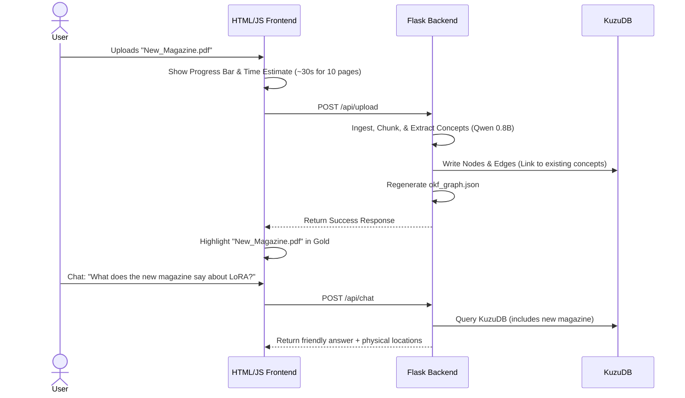

# Pilot Project: Live Ingestion & Conversational Chat Demo Workflow

This document outlines the workflow and UI/UX design for a live pilot demo where a user uploads a new PDF (e.g., a 10-page document), sees a real-time progress loader, views the new document dynamically connected to the existing graph, and chats with the library assistant about the updated corpus.

---

## 1. The Demo User Flow



---

## 2. UI/UX Interface Design

To make the demo look premium and interactive, we design a split-screen dashboard:

```
+------------------------------------------+------------------------------------------+
|            VISUAL GRAPH PANEL            |         CONTROL & CHAT ASSISTANT         |
|                                          |                                          |
|  [ BERT ] ------- (Self-Attention)       |  +------------------------------------+  |
|                         |                |  | 📂 UPLOAD NEW BOOK / MAGAZINE       |  |
|                         |                |  | [ Choose File ]  [ Ingest Document]|  |
|                         |                |  +------------------------------------+  |
|    [ New_Magazine ] ----+ (Gold Node)    |  | Processing: [==========] 45% (15s) |  |
|                         |                |  +------------------------------------+  |
|                         |                |                                          |
|  [ LoRA ] ------- (Low-Rank)             |  +------------------------------------+  |
|                                          |  | 💬 CHAT ASSISTANT                  |  |
|                                          |  | Student: "What is the new text?"   |  |
|                                          |  | AI: "The new magazine discusses... |  |
|                                          |  | It is at Rack 3, Box B."           |  |
|                                          |  +------------------------------------+  |
+------------------------------------------+------------------------------------------+
```

---

## 3. How the Connections are Created Dynamically

The new document is automatically connected to the existing graph during the merge phase in `okf_pipeline.py`. 

### The Ingestion Merging Process:
1. **Concept Canonicalization**: If the new magazine mentions "Low-Rank Adaptation", the pipeline matches it to the existing concept node `Low-Rank Adaptation` in the database.
2. **Bridging Edges**: Instead of creating a new concept node, it simply adds a `MENTIONS` edge from the new magazine chunk to the existing concept.
3. **Visualization Color Highlighting**: In `graph_ui/index.html`, we set the node color based on `doc_id`. If `doc_id == 'New_Magazine.pdf'`, we draw it as a **glowing gold node** so the audience can immediately see how it connects to the rest of the library.

---

## 4. Querying the Chat Model (Model 2)

When the user asks: *"What does the new magazine say about LoRA?"*, the chat assistant handles it using this workflow:

1. **Understand Intent**: The LLM parses the user question and detects they are asking about the `New_Magazine.pdf` document.
2. **Query Database (Tool Use)**: The LLM triggers a Cypher query:
   ```cypher
   MATCH (d:Document {id: 'New_Magazine.pdf'})-[:HAS_CHUNK]->(chk:Chunk)-[:MENTIONS]->(c:Concept)
   RETURN c.name AS concept, chk.text_passage AS explanation
   ```
3. **Formulate Response**: The LLM receives the concepts and passages from the database, summarizes them, and presents them in natural language:
   > *"The new magazine covers the concept of **Low-Rank Adaptation** (in Section 2, Page 3), stating that it reduces trainable parameters by 10,000 times."*
