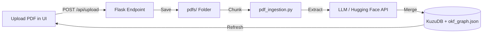

# PDF Redirection, File Upload, & Ranking Engine Specification

This specification details how to implement PDF redirection (local and cloud-based), add a PDF upload feature to dynamically expand the graph, and rank recommendations using a weighted multi-attribute rating formula.

---

## 1. Local & Cloud PDF Redirection (Page-Level Links)

Most modern browsers natively support jumping directly to a page in a PDF by appending `#page=N` to the URL.

### Local Configuration
Flask can serve your PDF files directory using `send_from_directory`:

```python
# In graph_server.py
from flask import send_from_directory

@app.route('/pdfs/<path:filename>')
def serve_pdf(filename):
    return send_from_directory('pdfs', filename)
```

In the UI, your redirecting links are constructed as:
```javascript
// Example local link to page 4 of Devlin2018_BERT.pdf
const link = `http://localhost:5050/pdfs/papers/Devlin2018_BERT.pdf#page=4`;
```

### Cloud Configuration (Hugging Face / S3)
If you deploy your app online (e.g. Hugging Face Spaces):
1. Save the PDFs in a Hugging Face Dataset repository or an AWS S3 bucket.
2. The server constructs the URL dynamically:

```python
# Server-side URL resolver
def get_pdf_url(doc_path, page):
    # If online, point to Hugging Face dataset file resolver
    HF_DATASET_URL = "https://huggingface.co/datasets/your_username/library-assets/resolve/main/"
    return f"{HF_DATASET_URL}{doc_path}#page={page}"
```

---

## 2. Upload File Feature to Ingest New Maps

To allow students to upload a new PDF and automatically add its concepts to the graph, we implement a file upload pipeline.



### Flask Backend Ingestion Endpoint
```python
import os
from flask import request, jsonify
from okf_pipeline import ingest_document, extract_concepts_for_chunks, merge_and_save

@app.route('/api/upload', methods=['POST'])
def upload_pdf():
    if 'file' not in request.files:
        return jsonify({"error": "No file uploaded"}), 400
        
    file = request.files['file']
    save_path = os.path.join('pdfs', file.filename)
    file.save(save_path)
    
    # 1. Chunk the new document
    new_chunks = ingest_document(save_path)
    
    # 2. Run LLM extraction on new chunks
    new_results = extract_concepts_for_chunks(new_chunks)
    
    # 3. Merge into KuzuDB and regenerate okf_graph.json
    merge_and_save(new_results)
    
    return jsonify({"success": True, "message": f"Ingested {file.filename}"})
```

---

## 3. Multi-Attribute Ranking Score Formulation

To calculate the best book/paper recommendation, we combine educational relevance with metadata attributes (ratings, citations, author overlap).

### The Math

$$\text{Recommendation Score} = w_{\text{freq}} \cdot \log(1 + f_c) + w_{\text{rating}} \cdot R + w_{\text{cite}} \cdot \log(1 + C) + w_{\text{author}} \cdot A$$

Where:
* **$f_c$ (Concept Frequency)**: How many chunks in this book explain the target concept. We take the log $\log(1 + f_c)$ so that a book mentioning a concept 40 times doesn't completely drown out a book mentioning it 5 times if the latter has better ratings.
* **$R$ (User Rating)**: The user rating of the book (0.0 to 5.0).
* **$C$ (Citation Count)**: The global academic citations of the paper (indicates scientific authority). We use a log scale here as citation counts vary by orders of magnitude (e.g. 10 vs 10,000).
* **$A$ (Author Overlap)**: If the user is currently reading a book by author $X$, and another book is written by author $X$, $A=1$, otherwise $0$. (Provides continuity of notation/style).

### Cypher Implementation Example
This Cypher query calculates and ranks recommendations using this formula:

```cypher
MATCH (doc:Document)-[:HAS_CHUNK]->(chk:Chunk)-[:MENTIONS]->(c:Concept)
WHERE c.name = 'Self-Attention Mechanism'
WITH doc, COUNT(chk) AS freq
// Define weights in Cypher
WITH doc, freq,
     2.0 AS w_freq,
     1.5 AS w_rating,
     1.0 AS w_cite,
     1.2 AS w_author,
     // check if same author as currently active book
     CASE WHEN doc.authors CONTAINS 'Vaswani' THEN 1.0 ELSE 0.0 END AS author_match
RETURN doc.title AS title,
       doc.shelf_location AS location,
       (w_freq * log(1 + freq)) + 
       (w_rating * COALESCE(doc.user_rating, 3.0)) + 
       (w_cite * log(1 + COALESCE(doc.citation_count, 0))) + 
       (w_author * author_match) AS recommendation_score
ORDER BY recommendation_score DESC
```
