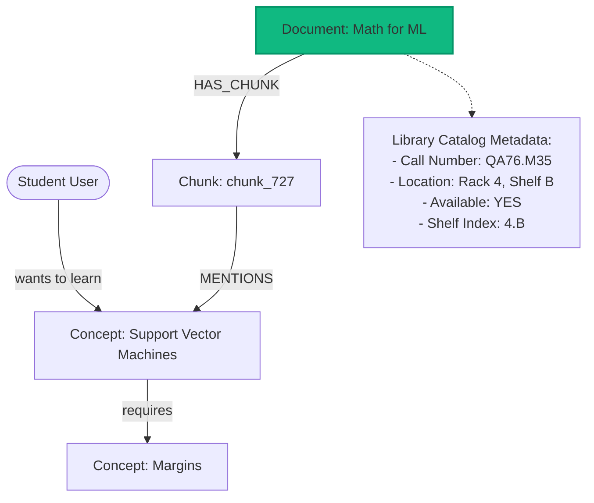
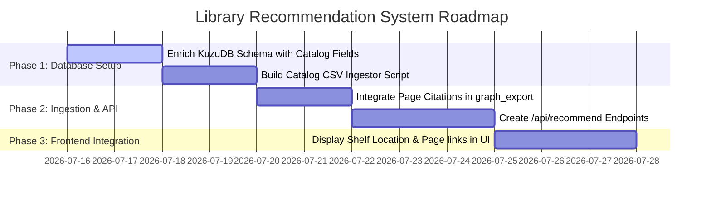

# University Library Recommendation System: Architecture & Implementation Plan

This plan outlines the design of a university-specific library recommendation system. The system combines the **Content-level Concept Graph** (concepts, page numbers, prerequisites) with **Library Catalog Metadata** (shelf location, call numbers, availability status) without requiring LLM re-training or fine-tuning.

---

## 1. Graph Database Integration Schema

The LLM is only responsible for extracting content-level concepts. The university library catalog data (availability, shelf indexes) is injected directly into KuzuDB during ingestion or updated dynamically via a database sync.



### Table Schema Definition

```sql
-- 1. Document Node properties (Library Catalog)
ALTER TABLE Document ADD COLUMN call_number STRING;       -- Dewey/Library of Congress index
ALTER TABLE Document ADD COLUMN shelf_location STRING;     -- e.g. "Rack 4, Shelf B"
ALTER TABLE Document ADD COLUMN availability BOOLEAN;     -- TRUE = on shelf, FALSE = checked out
ALTER TABLE Document ADD COLUMN copies_available INT64;    -- Current copies in library
ALTER TABLE Document ADD COLUMN total_copies INT64;        -- Total library inventory
```

---

## 2. Surfacing Exact Pages and Citations

Because KuzuDB stores chunk relations, we can query the exact **Page Number, Section Title, and Source Text Span** for any concept in any book:

### Cypher Query: Get Exact Page Citation for a Concept
```cypher
MATCH (d:Document)-[:HAS_CHUNK]->(chk:Chunk)-[:MENTIONS]->(c:Concept)
WHERE c.name = 'Low-Rank Adaptation'
RETURN d.title AS book_title,
       d.call_number AS call_number,
       d.shelf_location AS shelf_location,
       chk.page_number AS page_number,
       chk.section_title AS section_title,
       chk.text_passage AS text_passage,
       d.availability AS available
```

*This query returns the exact page and section, alongside the physical shelf location and availability of the book.*

---

## 3. The Recommendation Scoring Algorithm

To recommend the best book for a student, we use a hybrid score:

$$\text{Recommendation Score} = w_1 \cdot \text{Availability} + w_2 \cdot \text{Prerequisite Coverage} + w_3 \cdot \text{Academic Authority} - w_4 \cdot \text{Missing Prerequisites}$$

### Recommendation Rules:
1. **Physical Availability Boost**: If a book is checked out (`availability = FALSE`), its score is heavily penalized. If it is available on the shelf (`availability = TRUE`), it gets a major boost.
2. **Prerequisites Checklist**: We check the user's completed concepts list. If the user is missing a prerequisite concept, we recommend a book that explains that prerequisite.
3. **Physical Locator mapping**: The system outputs:
   > *"We recommend reading **Deisenroth_Math_For_ML.pdf** (page 83, Section 3.2.3) to learn Orthogonal Matrices. It is currently **Available** at **Rack 4, Shelf B** (Call Number: QA76.M35)."*

---

## 4. Step-by-Step Implementation Roadmap



### Step 1: Database Enrichment
Create a CSV file `library_catalog.csv` containing your 50 books:
```csv
doc_id,title,authors,call_number,shelf_location,availability,copies_available
textbooks/Deisenroth_Math_For_ML.pdf,Mathematics for Machine Learning,"Deisenroth, Faisal, Ong",QA76.M35,"Rack 4, Shelf B",True,2
papers/Devlin2018_BERT.pdf,BERT: Pre-training of Deep Bidirectional Transformers,Devlin et al.,QA76.73.P98,"Rack 2, Box A",True,1
```
Modify `okf_pipeline.py` or write an update script to load this CSV and update KuzuDB:
```python
# python code to enrich KuzuDB from CSV
import csv
import kuzu

db = kuzu.Database("okf_graph.db")
conn = kuzu.Connection(db)

with open("library_catalog.csv") as f:
    reader = csv.DictReader(f)
    for row in reader:
        conn.execute(f"""
            MATCH (d:Document) WHERE d.id = '{row['doc_id']}'
            SET d.call_number = '{row['call_number']}',
                d.shelf_location = '{row['shelf_location']}',
                d.availability = {row['availability'].lower() == 'true'},
                d.copies_available = {int(row['copies_available'])}
        """)
```

### Step 2: Implement the API Endpoint
Add an API route `/api/recommend` to `graph_server.py`:
```python
@app.route("/api/recommend/concept/<concept_name>")
def recommend_for_concept(concept_name):
    # Traverses the graph to find matching documents, orders by availability
    # and frequency, and returns:
    # { "book": doc_title, "page": page_num, "location": shelf_location, "available": true }
    ...
```

### Step 3: Display in UI
Update the frontend flashcards or info sidebar in `graph_ui/index.html` to show:
- 📖 **Page & Section Link** (e.g. *Page 83 — Section 3.2*)
- 📍 **Library Location**: *Rack 4, Shelf B*
- 🟢 **Status**: *Available (2 copies)* / 🔴 *Checked Out*
